# IELTS Beta

IELTS Beta is a web app for IELTS test preparation. Students take practice tests and track their band-score progress; teachers manage course content; admins manage user accounts. It's a full-stack project with a Spring Boot REST API backend and a Next.js frontend.

---

## Features

**Authentication**
- Registration and login (session-based, via Spring Security)
- Role-based access: `STUDENT`, `TEACHER`, `ADMIN`
- Password hashing with BCrypt

**Student**
- Dashboard with progress overview
- Browse courses and course details
- Take practice tests (multiple-choice)
- View band-score progress over time (charted with Chart.js)

**Teacher**
- Teacher dashboard

**Admin**
- View all user accounts
- Suspend a user account
- Delete a user account

---

## Tech Stack

| Layer | Technology |
|---|---|
| Backend | Java 21, Spring Boot 4, Spring Web MVC, Spring Data JPA (Hibernate), Spring Security |
| Database | PostgreSQL |
| Auth | Session-based auth via Spring Security, BCrypt password hashing |
| Backend build/tools | Maven |
| Backend testing | JUnit 5, Mockito, JaCoCo (coverage) |
| Frontend | Next.js 16, React 19, TypeScript |
| Frontend styling | Tailwind CSS 4 |
| Frontend charts | Chart.js |

---

## Project Structure

```
IELTS-BETA/
├── backend/     Spring Boot REST API (Java)
│   └── src/main/java/com/ieltsbeta/backend/
│       ├── controller/   REST endpoints
│       ├── service/      business logic
│       ├── repository/   Spring Data JPA repositories
│       ├── entity/       JPA entities
│       ├── dto/          request/response objects
│       ├── config/       Spring Security config
│       ├── exception/    custom exceptions + global handler
│       └── pattern/      design pattern implementations
└── frontend/    Next.js app (TypeScript)
    └── src/app/
        ├── admin/        admin dashboard + user management
        ├── student/      student dashboard, courses, tests, progress
        ├── teacher/      teacher dashboard
        ├── login/        login page
        └── registration/ registration page
```

---

## Entity-Relationship Diagram (ERD)

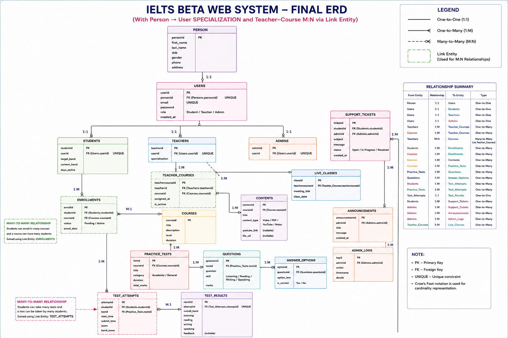

---

## Database Schema

Full schema (18 tables, PostgreSQL/Supabase, with constraints): [`docs/SCHEMA.sql`](docs/SCHEMA.sql)

The ERD and schema above represent the complete planned design. The backend currently implements the core account + practice-test flow — `person`, `users`, `students`, `teachers`, `admins`, `practice_tests`, `questions`, `answer_options`, `test_attempts`, `test_results`. Tables for courses, enrollments, content, live classes, support tickets, announcements, and admin logs are part of the schema but not yet wired into the backend.

---

## Design Patterns

The backend implements five design patterns (Strategy, Factory Method, Facade, Observer, Adapter) as part of the test-scoring flow.

Full write-up with UML diagrams: [`DESIGN_PATTERNS.md`](https://github.com/shook-04/IELTS-BETA/blob/main/backend/src/main/java/com/ieltsbeta/backend/pattern/DESIGN_PATTERNS.md)

---

## Testing

The backend has 116 unit tests (JUnit 5 + Mockito), with coverage measured by JaCoCo.

Full write-up with coverage results: [`TESTING.md`](https://github.com/shook-04/IELTS-BETA/blob/main/backend/src/test/java/com/ieltsbeta/backend/TESTING.md)

---

## Screenshots
 
**Landing**
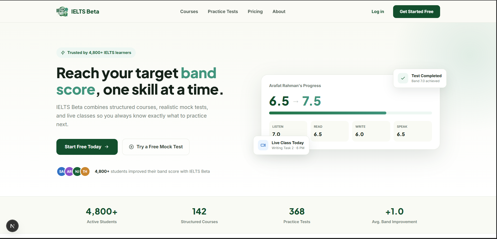
 
**Auth**
| Login | Registration |
|---|---|
| 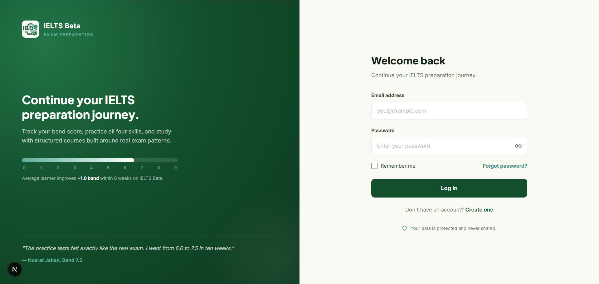 | 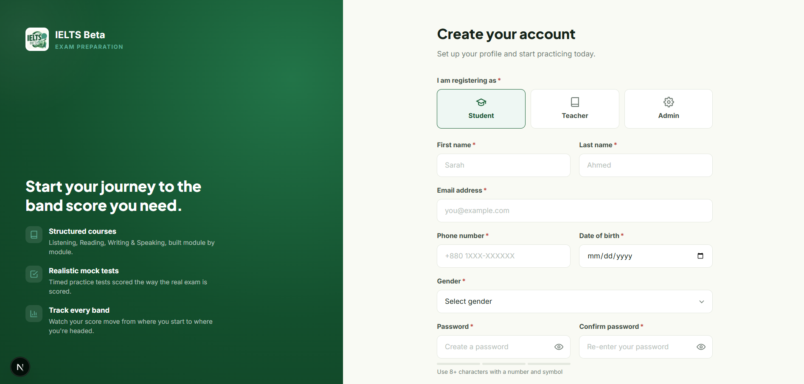 |
 
**Student**
| Dashboard | Courses |
|---|---|
| 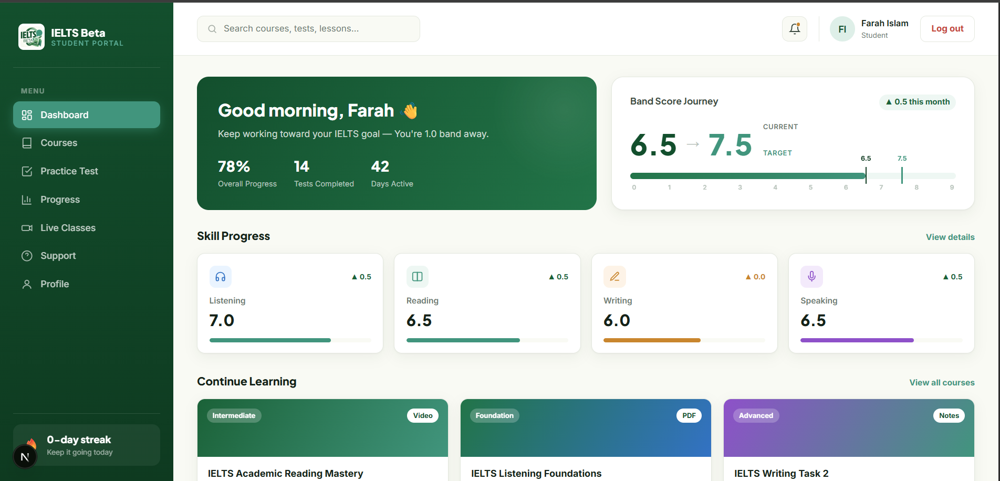 | 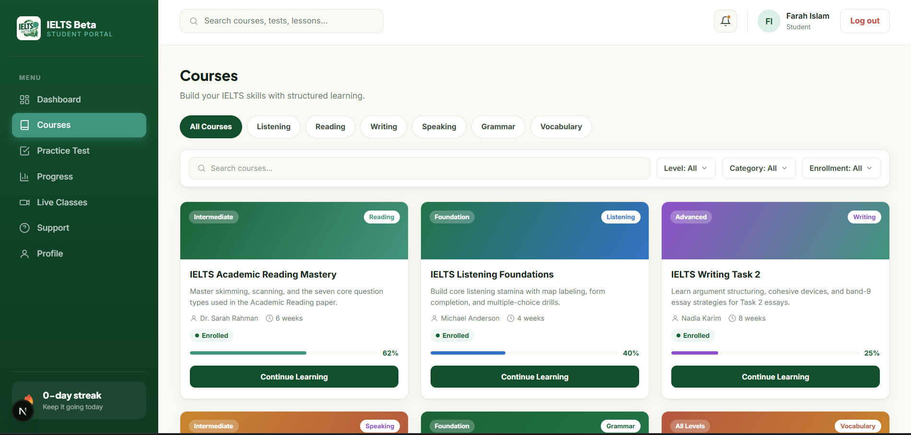 |
 
| Practice Test | Progress |
|---|---|
| 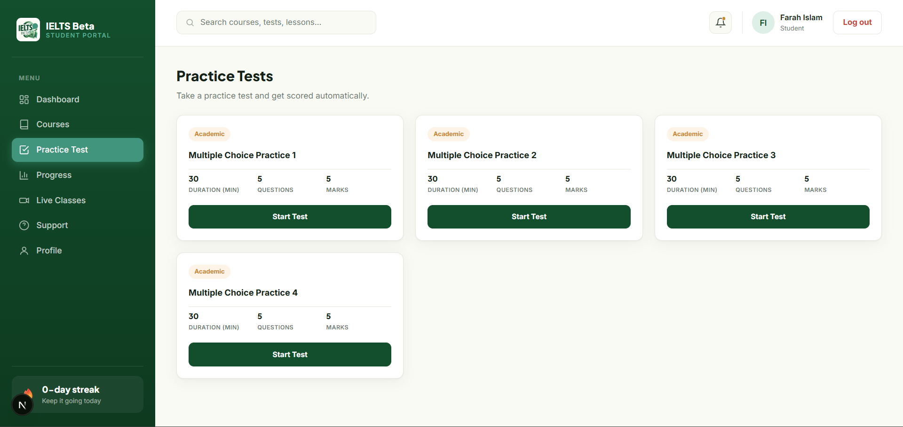 | 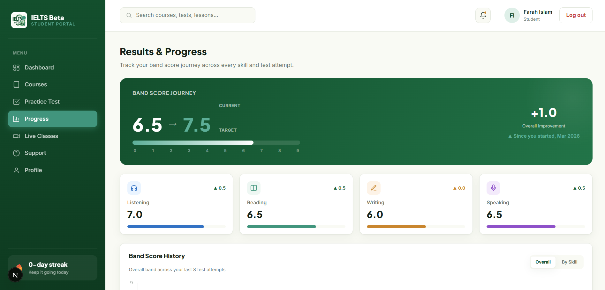 |
 
**Teacher**
| Dashboard |
|---|
| 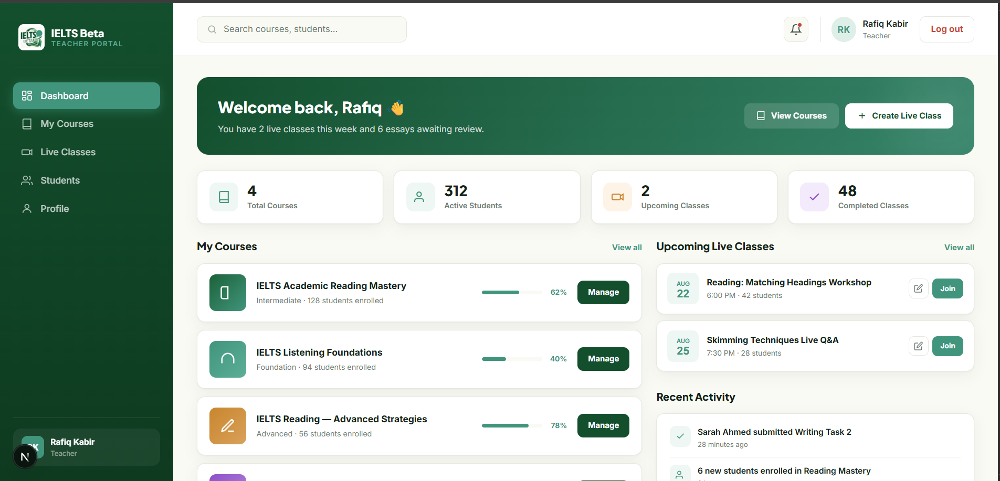 |
 
**Admin**
| Dashboard | Users |
|---|---|
| 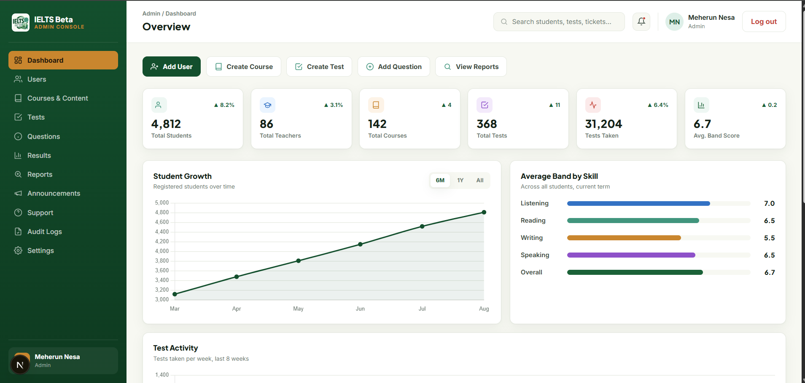 | 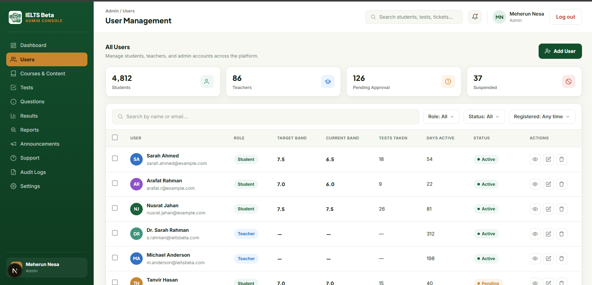 |
 
---

## Getting Started

### Backend
```bash
cd backend
# create src/main/resources/application.properties with your DB credentials
# (this file is gitignored — it isn't in the repo)
mvn clean spring-boot:run
```
Runs on `http://localhost:8080`.

### Frontend
```bash
cd frontend
npm install
npm run dev
```
Runs on `http://localhost:3000` (the backend's CORS config allows this origin).

---

## API Overview

| Method | Endpoint | Access |
|---|---|---|
| POST | `/api/auth/register` | Public |
| POST | `/api/auth/login` | Public |
| GET | `/api/auth/me` | Authenticated |
| POST | `/api/auth/logout` | Authenticated |
| GET | `/api/tests` | Public |
| GET | `/api/tests/{testId}` | Public |
| POST | `/api/tests/{testId}/submit` | Authenticated |
| GET | `/api/tests/results` | Authenticated |
| GET | `/api/admin/users` | Admin |
| PUT | `/api/admin/users/{id}/suspend` | Admin |
| DELETE | `/api/admin/users/{id}` | Admin |
| GET | `/api/health` | Public |
