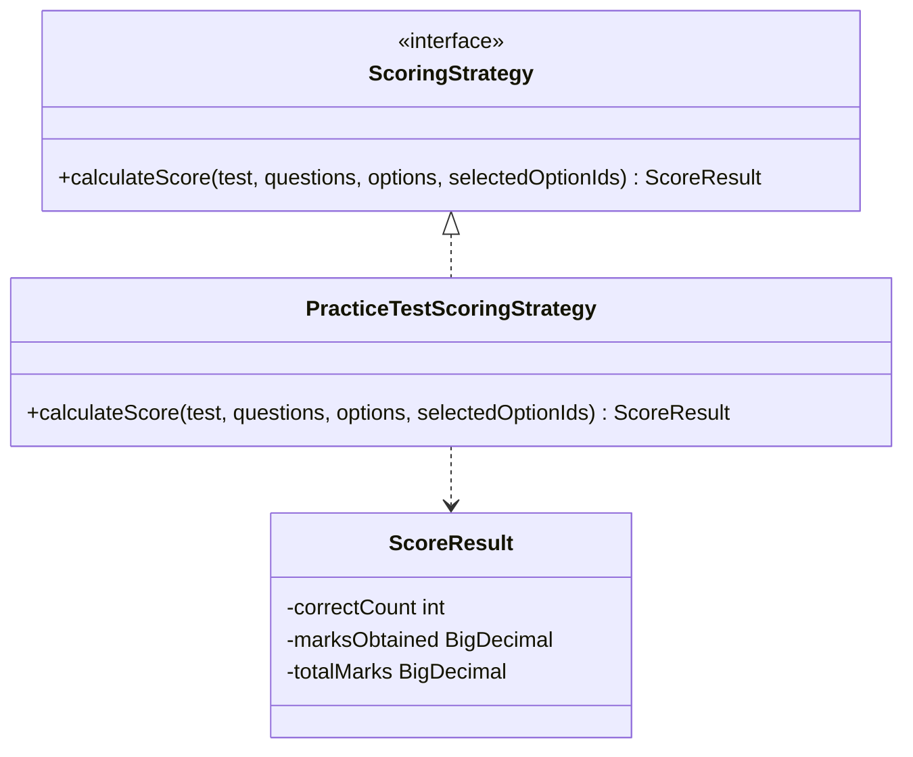
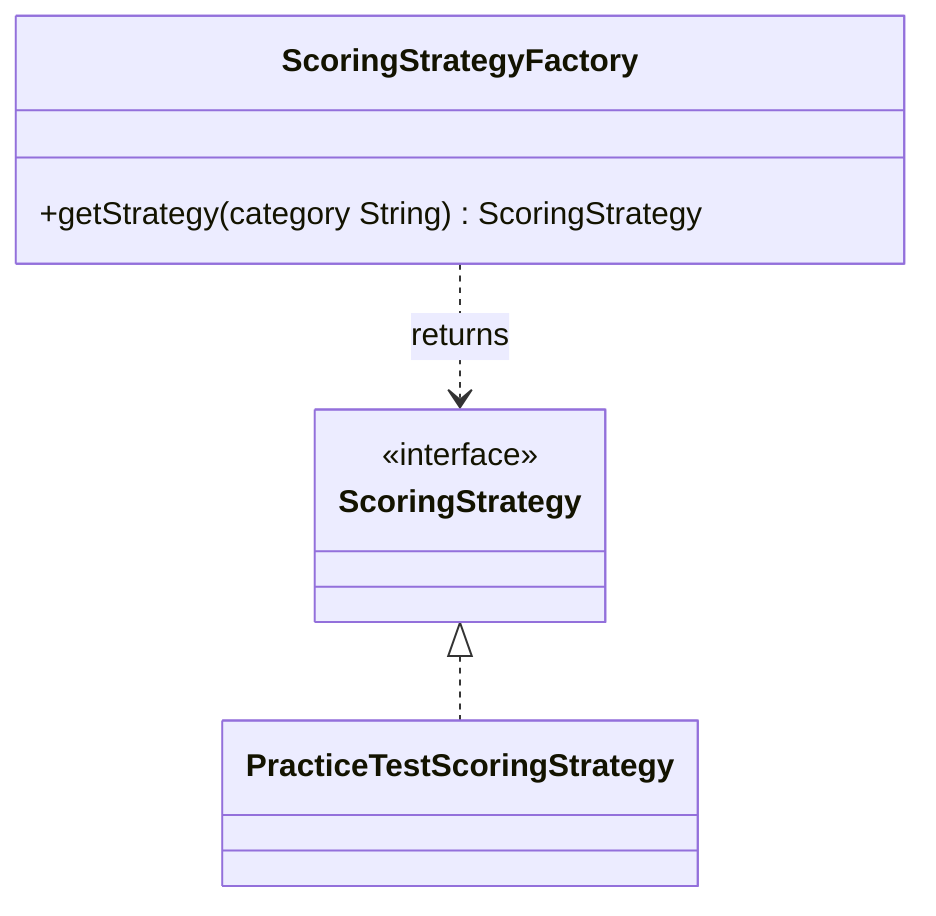
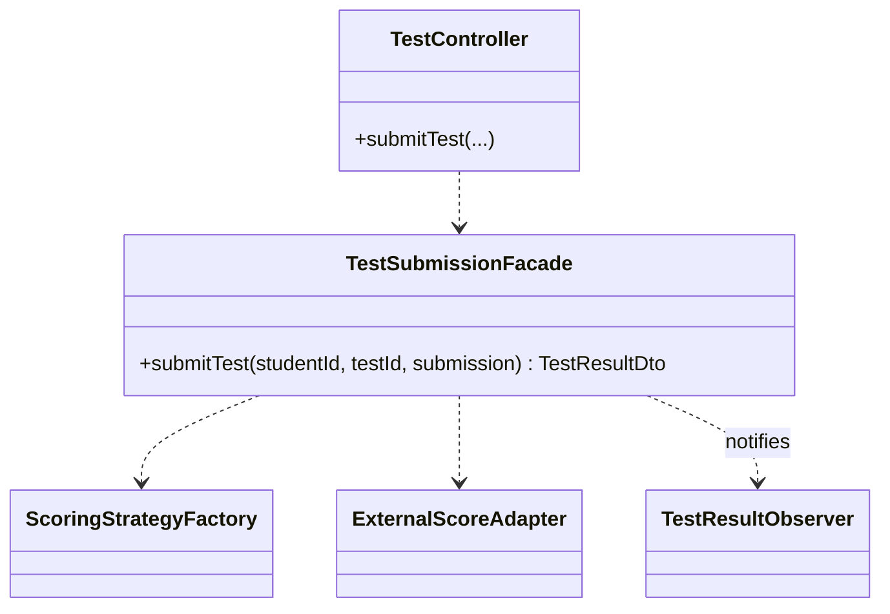
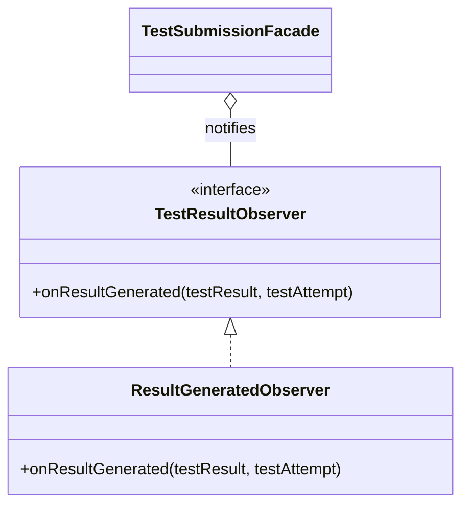
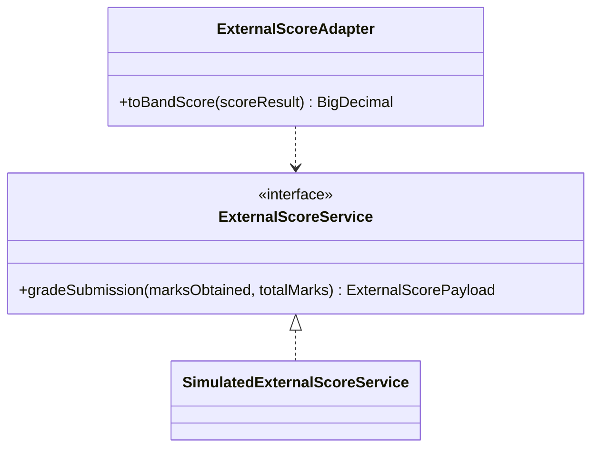

# Design Patterns — IELTS-BETA

Module: `backend` (Spring Boot, Java 21)

All five patterns live under `backend/src/main/java/com/ieltsbeta/backend/pattern/` and are used by the real test-submission flow: `TestController` → `TestSubmissionFacade` → `ScoringStrategyFactory` → `ScoringStrategy` → `ExternalScoreAdapter` → observers. Each one has its own unit tests under `backend/src/test/java/.../pattern/`.

---

## 1. Strategy

**Files:** `pattern/strategy/ScoringStrategy.java`, `pattern/strategy/PracticeTestScoringStrategy.java`, `pattern/strategy/ScoreResult.java`

**Problem it solves:**
Scoring a submitted test could work differently for different test categories in the future. `ScoringStrategy` defines a common `calculateScore(...)` method. `PracticeTestScoringStrategy` is the current implementation — it gives marks for a question only when the selected option is correct. `TestSubmissionFacade` calls this method without knowing which implementation is behind it.

**UML Diagram:**

**Explanation:** `PracticeTestScoringStrategy` implements the `ScoringStrategy` interface and returns a `ScoreResult`. A new test category with a different scoring rule can be added as a new class implementing the same interface, with no changes elsewhere.

---

## 2. Factory Method

**Files:** `pattern/factory/ScoringStrategyFactory.java`

**Problem it solves:**
Something has to decide which `ScoringStrategy` to use for a given test category, without putting that decision logic in the controller or the facade. `ScoringStrategyFactory.getStrategy(category)` does this: `"Academic"` and `"General"` both return `PracticeTestScoringStrategy`; any other value throws `UnsupportedTestCategoryException`.

**UML Diagram:**

**Explanation:** The factory hides the category-to-strategy mapping in one place. Adding a new category just means adding a case here, not changing every caller.

---

## 3. Facade

**Files:** `pattern/facade/TestSubmissionFacade.java`

**Problem it solves:**
Submitting a test involves several steps: load the test, validate answers, score it, convert to a band, save the result, notify observers. `TestSubmissionFacade.submitTest(...)` wraps all of that into one method, so `TestController` only has to make one call.

**UML Diagram:**

**Explanation:** `TestSubmissionFacade` sits between the controller and the rest of the system (repositories, Strategy, Adapter, Observers). The controller stays simple.

---

## 4. Observer

**Files:** `pattern/observer/TestResultObserver.java`, `pattern/observer/ResultGeneratedObserver.java`

**Problem it solves:**
After a result is saved, other things may need to happen (currently: logging). `TestResultObserver` is an interface with one method, `onResultGenerated(...)`. Spring collects every class that implements it and the facade notifies all of them.

**UML Diagram:**

**Explanation:** `TestSubmissionFacade` is the subject; `ResultGeneratedObserver` is one observer. A new reaction to a saved result (e.g. sending an email) can be added as a new observer class, without touching the facade.

---

## 5. Adapter

**Files:** `pattern/adapter/ExternalScoreAdapter.java`, `pattern/adapter/ExternalScoreService.java`, `pattern/adapter/SimulatedExternalScoreService.java`, `pattern/adapter/ExternalScorePayload.java`

**Problem it solves:**
A simulated external scoring service only returns percentages (0–100). The app needs IELTS band scores (0.0–9.0). `ExternalScoreAdapter.toBandScore(...)` converts one into the other, using a simple linear rule (0% → band 4.0, 100% → band 9.0).

**UML Diagram:**

**Explanation:** `ExternalScoreAdapter` is the adapter, `SimulatedExternalScoreService` is the incompatible service being adapted, and `TestSubmissionFacade` only ever talks to the adapter — never to the percentage-based service directly.

---

## Summary Table

| # | Pattern | Main class | Package |
|---|---|---|---|
| 1 | Strategy | `ScoringStrategy` / `PracticeTestScoringStrategy` | `pattern.strategy` |
| 2 | Factory Method | `ScoringStrategyFactory` | `pattern.factory` |
| 3 | Facade | `TestSubmissionFacade` | `pattern.facade` |
| 4 | Observer | `TestResultObserver` / `ResultGeneratedObserver` | `pattern.observer` |
| 5 | Adapter | `ExternalScoreAdapter` | `pattern.adapter` |