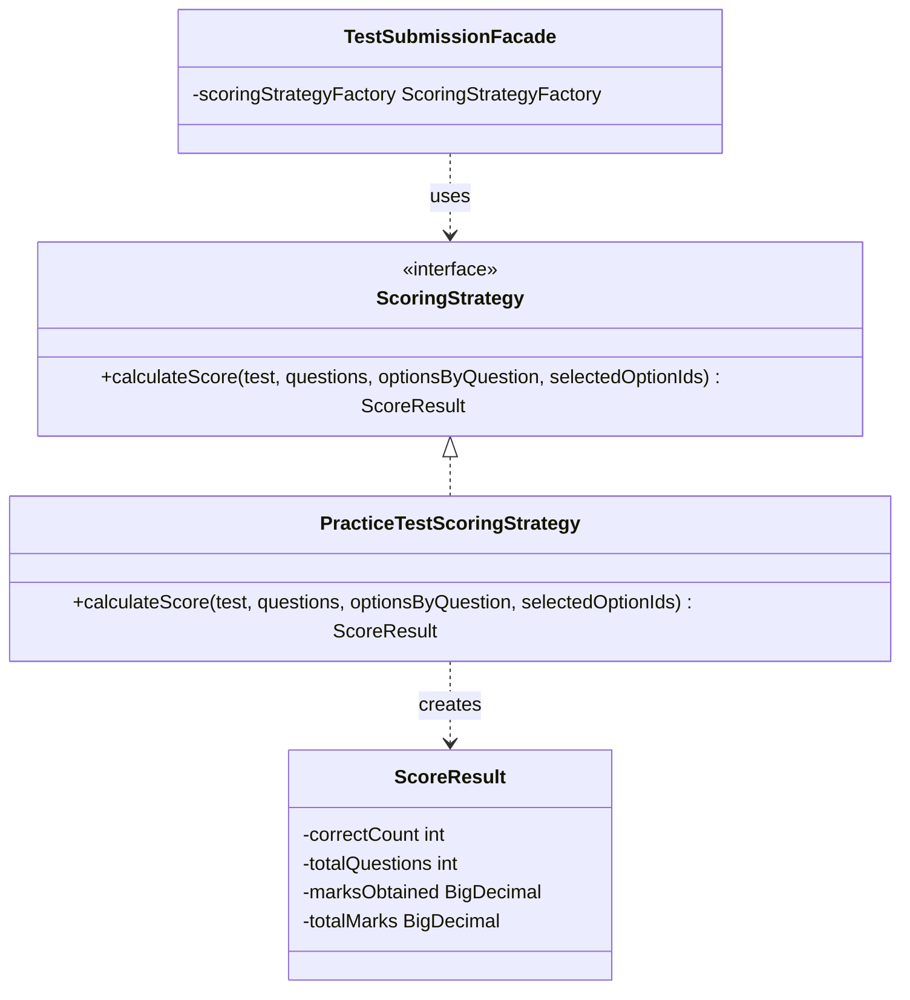
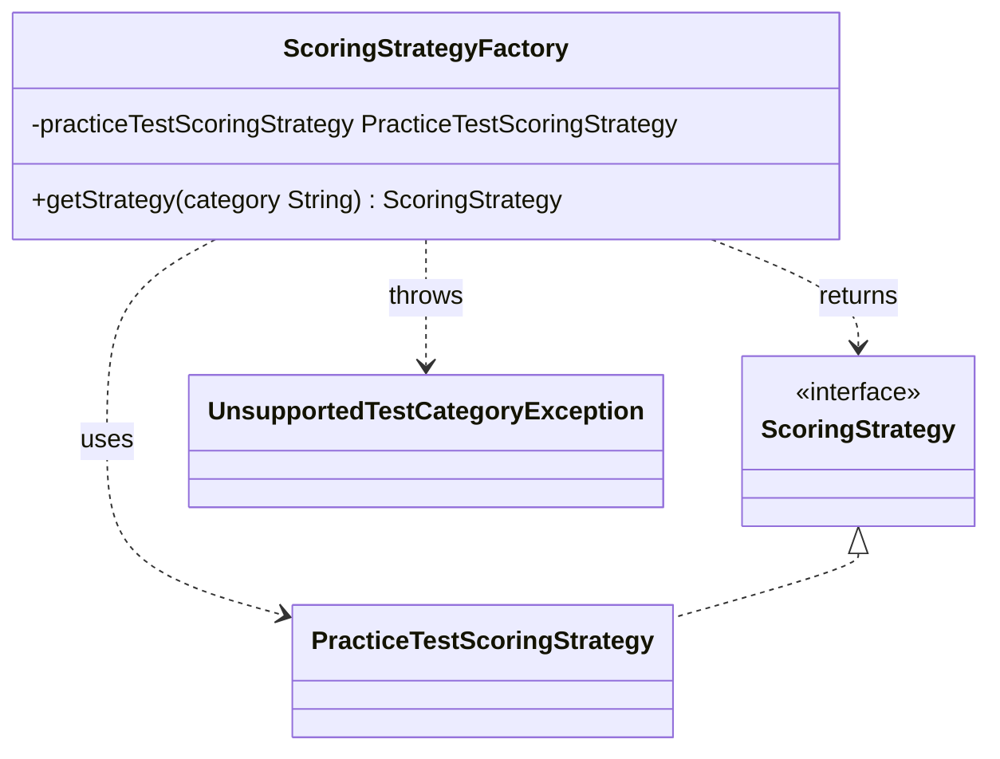
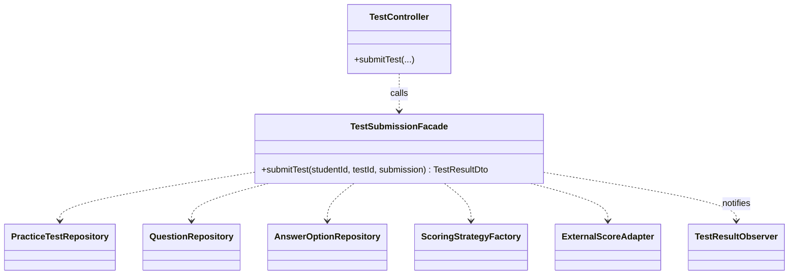
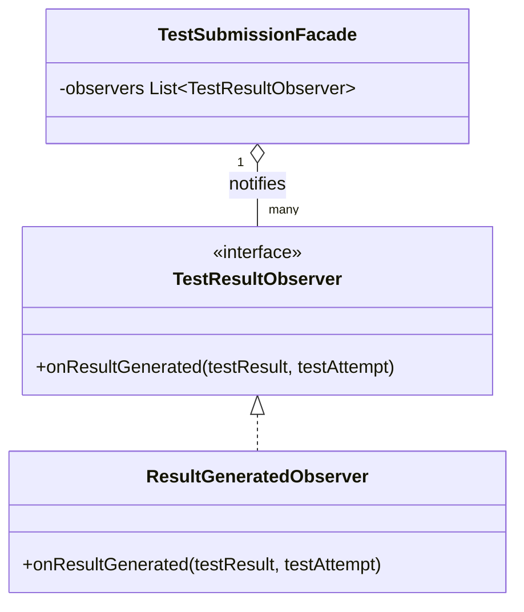
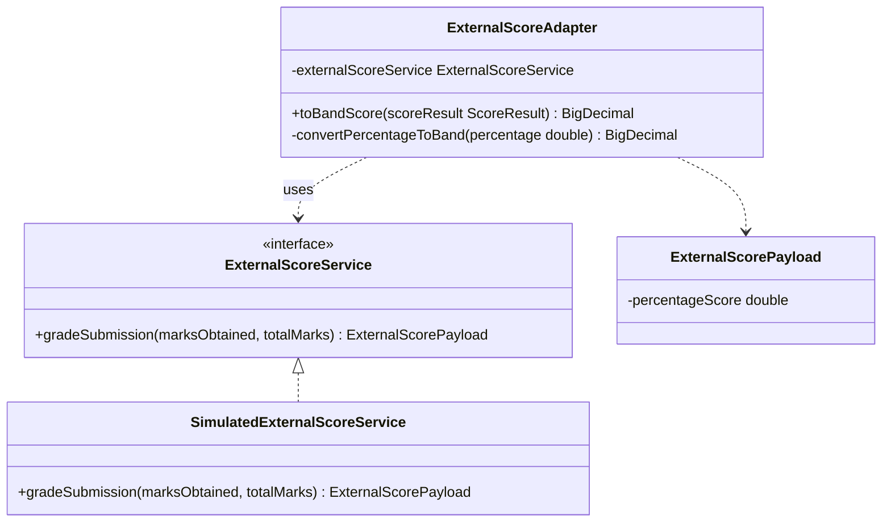

# Design Patterns — IELTS-BETA

Repo: https://github.com/shook-04/IELTS-BETA
Module: `backend` (Spring Boot, Java 21)

All five patterns below live under `backend/src/main/java/com/ieltsbeta/backend/pattern/`, are wired together by Spring's dependency injection, and are each covered by dedicated unit tests under `backend/src/test/java/.../pattern/`. They are not demo/toy classes — every one of them sits on the real test-submission flow: `TestController` → `TestSubmissionFacade` → (`ScoringStrategyFactory` → `ScoringStrategy`) → `ExternalScoreAdapter` → observers.

---

## 1. Strategy

**Files:** `pattern/strategy/ScoringStrategy.java` (interface), `pattern/strategy/PracticeTestScoringStrategy.java` (concrete strategy), `pattern/strategy/ScoreResult.java` (return value)

**Problem it solves:**
A practice test needs to be scored (turn a student's selected answer options into a correct-count and a marks total). Different test categories could require different scoring algorithms in the future (e.g. multiple-choice vs. weighted questions vs. partial credit), but the caller (`TestSubmissionFacade`) shouldn't need to know or change when a new scoring algorithm is added. `ScoringStrategy` defines the algorithm's interface (`calculateScore(test, questions, optionsByQuestion, selectedOptionIds)`); `PracticeTestScoringStrategy` supplies the concrete multiple-choice implementation, awarding a question's marks only when the selected option is flagged `isCorrect()`. Deliberately, `ScoreResult` carries only raw correctness/marks data — never a band score — so scoring stays a single-purpose algorithm rather than also owning the IELTS-band conversion (that's the Adapter's job, kept as pattern #5).

**UML Diagram:**

**Structure:** `TestSubmissionFacade` never references `PracticeTestScoringStrategy` directly — it holds a `ScoringStrategy` reference obtained from the Factory (pattern #2) and calls `calculateScore()` polymorphically. Swapping in a new algorithm for another test category means adding a new `ScoringStrategy` implementation with zero changes to the Facade.

---

## 2. Factory Method

**Files:** `pattern/factory/ScoringStrategyFactory.java`

**Problem it solves:**
The submission flow needs to pick the right `ScoringStrategy` for a given `PracticeTest`, based on the test's `category` field, without the Facade (or the controller) containing that selection/`if`-`else` logic itself. `ScoringStrategyFactory.getStrategy(String category)` centralizes that decision: `"Academic"` and `"General"` both currently resolve to `PracticeTestScoringStrategy`, and any other value is a genuine error — it throws `UnsupportedTestCategoryException` rather than silently falling back to a default strategy.

**UML Diagram:**

**Structure:** The Factory is the single point of variation between "which category" and "which algorithm object". Adding a new category+algorithm pair only means adding a new `case` branch and injecting the new `ScoringStrategy` bean — callers of `getStrategy()` are unaffected.

---

## 3. Facade

**Files:** `pattern/facade/TestSubmissionFacade.java`

**Problem it solves:**
Submitting a test attempt is a multi-step workflow: load the test and its questions, validate the submitted answers belong to the test, resolve and run the correct `ScoringStrategy` (via the Factory), convert the raw score to a band score (via the Adapter), persist a `TestAttempt` and a `TestResult`, and notify observers. `TestSubmissionFacade.submitTest(studentId, testId, submission)` is the single entry point that hides all of this from `TestController`, which just calls one method and stays a thin HTTP layer.

**UML Diagram:**

**Structure:** `TestSubmissionFacade` composes six repositories/collaborators (see constructor) behind one `@Transactional` method. It is the classic Facade shape — a simplified, unified interface (`submitTest`) sitting in front of a subsystem of finer-grained components.

---

## 4. Observer

**Files:** `pattern/observer/TestResultObserver.java` (subject-side interface), `pattern/observer/ResultGeneratedObserver.java` (concrete observer)

**Problem it solves:**
After a `TestResult` is saved, other parts of the system may need to react (today: logging; naturally extensible to emailing the student, updating analytics, etc.) without `TestSubmissionFacade` being coupled to each of those concerns. `TestResultObserver` defines `onResultGenerated(testResult, testAttempt)`; Spring auto-collects every bean implementing it into a `List<TestResultObserver>`, which the Facade injects and loops over at the end of `submitTest()`.

**UML Diagram:**

**Structure:** `TestSubmissionFacade` is the Subject (it holds the list of observers and triggers notification); every `TestResultObserver` implementation is an Observer. Adding a new reaction to a generated result (e.g. a notification service) means adding one new `@Component` implementing the interface — no change to the Facade.

---

## 5. Adapter

**Files:** `pattern/adapter/ExternalScoreAdapter.java`, `pattern/adapter/ExternalScoreService.java` (target-ish interface for the external/legacy engine), `pattern/adapter/SimulatedExternalScoreService.java` (adaptee implementation), `pattern/adapter/ExternalScorePayload.java` (adaptee's data shape)

**Problem it solves:**
The (simulated) external/legacy scoring engine only knows how to grade in raw percentages (`ExternalScorePayload`, 0–100) — it has no concept of IELTS bands. The rest of the application works in band scores (`BigDecimal`, 0.0–9.0). `ExternalScoreAdapter.toBandScore(ScoreResult)` adapts between the two: it calls the external-style service to get a percentage, then converts that percentage into a band score using a documented linear rule (4.0 at 0%, 9.0 at 100%, rounded to the nearest 0.5, clamped to [0, 9]). This is also the single authoritative place a band score is produced in the whole app.

**UML Diagram:**

**Structure:** `ExternalScoreAdapter` is the Adapter, `ExternalScoreService`/`SimulatedExternalScoreService` play the Adaptee (the incompatible, percentage-only "legacy" interface), and `TestSubmissionFacade` is the Client — it only ever calls `toBandScore(ScoreResult)` and never touches `ExternalScorePayload` directly.

---

## Summary Table

| # | Pattern | Primary class | Package |
|---|---|---|---|
| 1 | Strategy | `ScoringStrategy` / `PracticeTestScoringStrategy` | `pattern.strategy` |
| 2 | Factory Method | `ScoringStrategyFactory` | `pattern.factory` |
| 3 | Facade | `TestSubmissionFacade` | `pattern.facade` |
| 4 | Observer | `TestResultObserver` / `ResultGeneratedObserver` | `pattern.observer` |
| 5 | Adapter | `ExternalScoreAdapter` | `pattern.adapter` |
